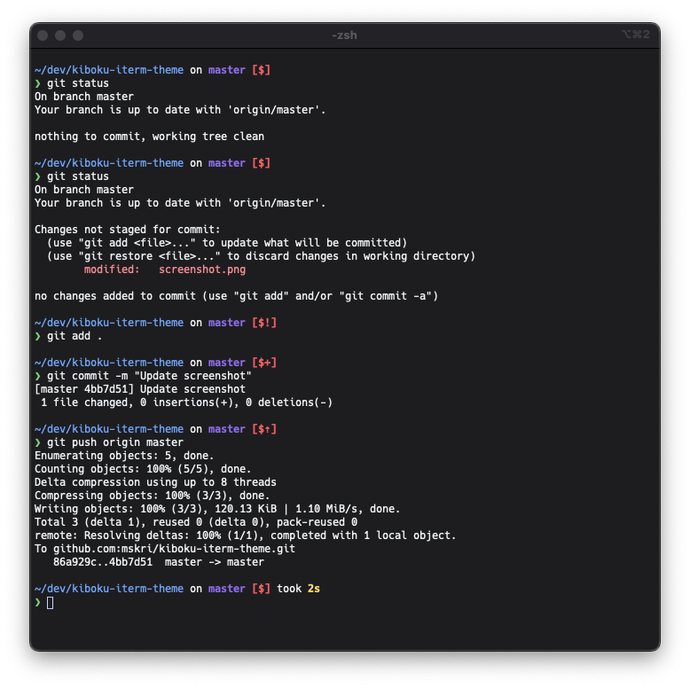

# Kiboku theme for iTerm 2

> A dark theme for [iTerm 2](http://iterm2.com) based on [Kiboku VS Code theme](https://github.com/mskri/kiboku-vscode-theme).

## Install

#### Install using git

Clone the repository

    $ git clone https://github.com/mskri/kiboku-iterm.git

To update pull latest changes

    $ git pull

#### Install manually

Download the [zip from GitHub](https://github.com/mskri/kiboku-iterm/archive/master.zip) and unzip it.

#### Activate theme in iTerm 2

1. _iTerm2 > Preferences > Profiles > Colors Tab_
2. Open _Color Presets..._ drop-down in the bottom right corner
3. Select _Import..._ from the list
4. Select `Kiboku.itermcolors` file
5. Select _Kiboku_ from _Color Presets..._ to active it

## License

[MIT](./LICENSE)
